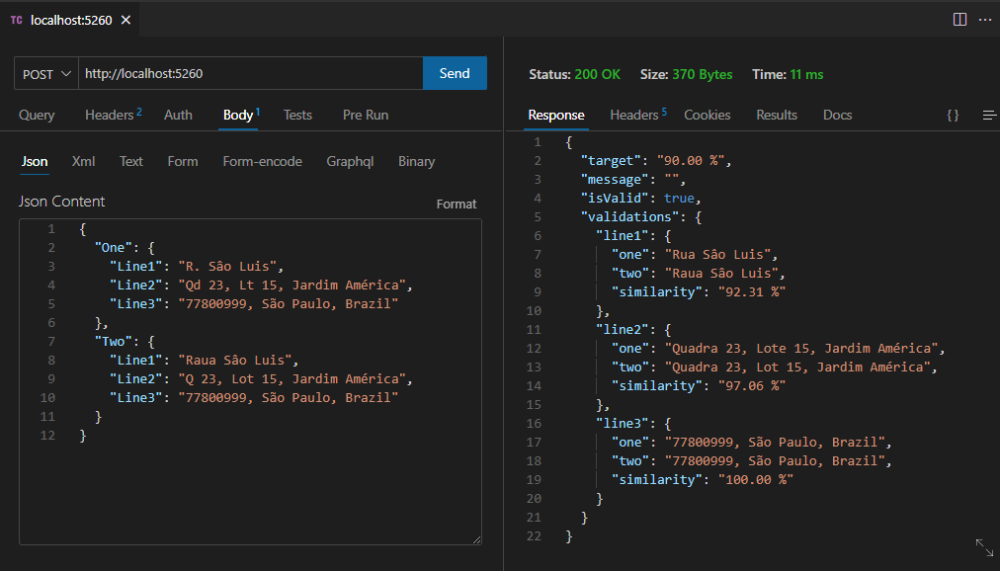

# POC to Sanitize and Validating two Addresses

The idea is to get two Addresses and check if they are equal even if both have different abbreviations.
The file `.\EngineValidator\PatternList.json` contains all possible patterns and the replaced word.

# Levenshtein Algorithm

Also known as the edit distance algorithm, it is a common method used for comparing the similarity between two strings. Most of the spelling correction, searching, and data entry validation uses this algorithm.

In this POC after sanitizing the addresses with a dynamic regex we compare two addresses to see their similarity and evaluate the result based on a target percentage.

Example:
